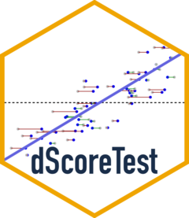

<!-- README.md is generated from README.Rmd. Please edit that file -->

```{r, include = FALSE}
knitr::opts_chunk$set(
  collapse = TRUE,
  comment = "#>",
  fig.path = "man/figures/README-",
  out.width = "100%"
)
```

# dScoreTest 

<!-- badges: start -->

<!-- badges: end -->

Debiased (Neyman-orthogonalized) score tests for assessing whether a
semiparametric or parametric regression model is well-specified and for
comparing nested models.

The test uses a hunt-and-test strategy with sample splitting: on a
held-out *hunt* sample, it fits the null model and uses machine learning
to find a direction in which the null model's score seems positive; on
an independent *test* sample, it assesses the significance of the score
in the hunted direction. The test employs orthogonalization to eliminate
the plug-in bias from estimating the null model, yielding a test
statistic that is asymptotically standard normal under the null without
requiring a parametric form for the alternative. Methods are provided
for `glm`, `lm`, and `mgcv::gam` fits.

## Installation

You can install the package from CRAN with

``` r
install.packages("dScoreTest")
```

or the development version from
[GitHub](https://github.com/richardkwo/dScoreTest) with

``` r
# install.packages("remotes")
remotes::install_github("richardkwo/dScoreTest")
```

## Usage

Two entry points, both S3 generics that dispatch on the fitted model:

- `gof_test()` — is a fitted model well-specified, against a
  nonparametric alternative?
- `compare_models()` — does a nested alternative capture signal that the
  null model misses?

```{r setup, message = FALSE}
library(dScoreTest)
library(mgcv)

set.seed(42)
dat <- gamSim(eg = 1, n = 400, dist = "normal", scale = 2, verbose = FALSE)
```

We simulate from the four-term additive truth in `mgcv::gamSim(eg = 1)`,
`y = f0(x0) + f1(x1) + f2(x2) + f3(x3) + noise`, where `f3 = 0` and
`f0, f1, f2` are non-linear.

### Goodness of fit

`gof_test()` checks the functional form of a fitted model against a
nonparametric alternative. A well-specified non-linear additive model is
not rejected, while forcing the model to be linear is.

```{r gof}
fit.gam <- gam(y ~ s(x0) + s(x1) + s(x2) + s(x3), data = dat)
gof_test(fit.gam)   # well-specified: not rejected

fit.lm <- lm(y ~ x0 + x1 + x2 + x3, data = dat)
gof_test(fit.lm)   # misspecified: 
```

Note that `gof_test` only sees the covariates in the model's formula, so
it tests whether `E[y | covariates]` has the assumed form, not whether
covariates are missing.

### Model comparison

`compare_models()` tests a null model against a nested alternative, and
detects signal living in the alternative's extra terms. Here the null
drops `s(x2)` (a real, sharp effect), while the alternative includes it.

```{r compare}
# null model: well-specified since f3 = 0 in DGM
fit.gam.null <- gam(y ~ s(x0) + s(x1) + s(x2), data = dat)
compare_models(fit.gam.null, fit.gam)

# null model: misspecified, missing f2
fit.gam.mis <- gam(y ~ s(x0) + s(x1), data = dat)  
res <- compare_models(fit.gam.mis, fit.gam)
res
```

Both functions return a `dScoreTest` object with `print()`, `summary()`,
and `plot()` methods. The hunt for a direction of misspecification can
use the optimal (`hunt.style = "optimal"`, default),
weighted-least-squares (`"wls"`), or vanilla (`"vanilla"`) algorithm.

```{r plot, fig.width = 9, fig.height = 4.5}
plot(res)
```
