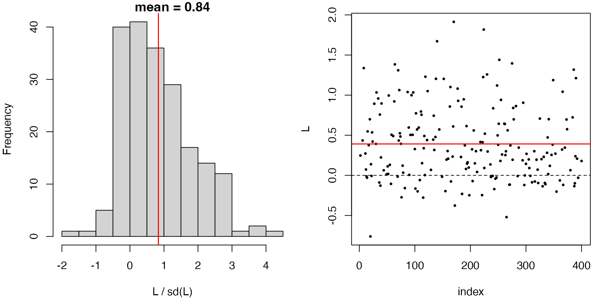
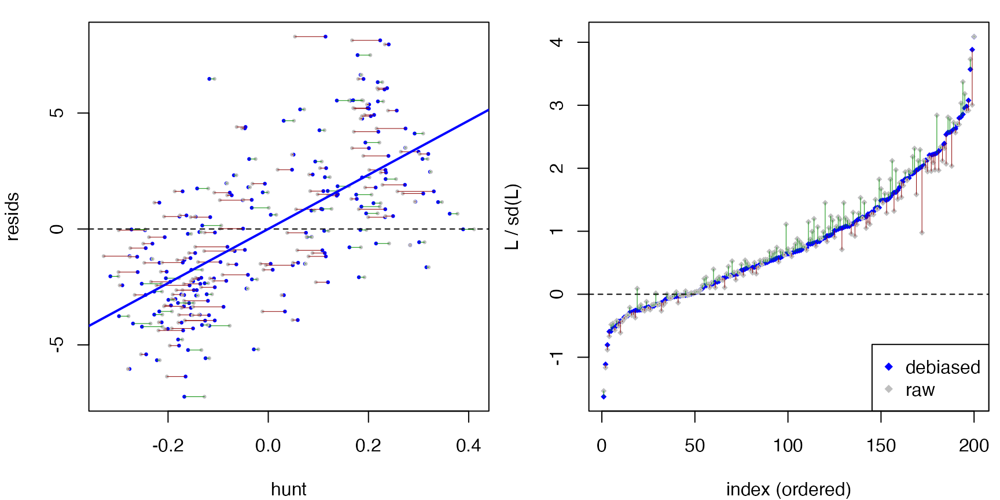
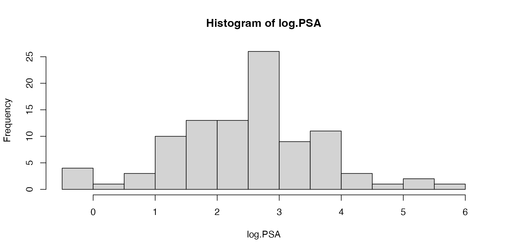
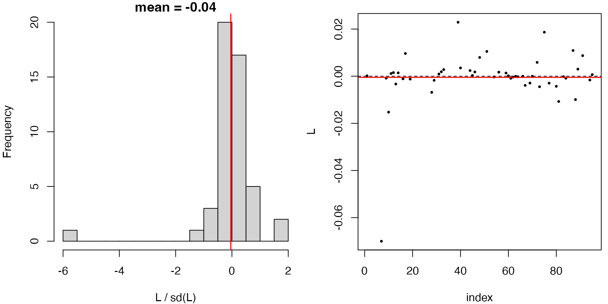
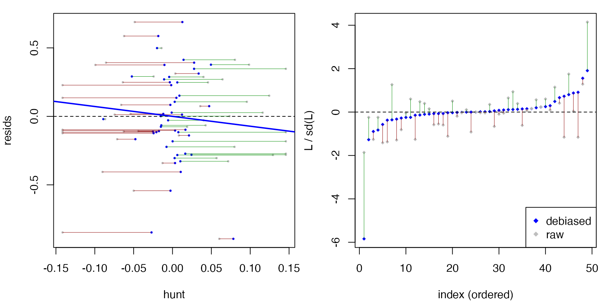

# Checking generalized additive models

``` r

library(dScoreTest)
library(mgcv)
```

This article walks through
[`gof_test()`](https://unbiased.co.in/dScoreTest/reference/gof_test.md)
and
[`compare_models()`](https://unbiased.co.in/dScoreTest/reference/compare_models.md)
on [`mgcv::gam`](https://rdrr.io/pkg/mgcv/man/gam.html) fits. Because
these examples lean on `grf` and refit GAMs across sample splits, they
are slower than the package vignette — this is a web-only article (not
run by `R CMD check`).

## Simulation example

We simulate from the four-term additive truth in `mgcv::gamSim(eg = 1)`,
``` math
y = f_0(x_0) + f_1(x_1) + f_2(x_2) + f_3(x_3) + \varepsilon,
```
where $`f_3 \equiv 0`$ and $`f_0, f_1, f_2`$ are nonlinear. The
covariates are independent uniforms.

``` r

set.seed(42)
dat <- gamSim(eg = 1, n = 400, dist = "normal", scale = 2, verbose = FALSE)
```

### Goodness of fit

[`gof_test()`](https://unbiased.co.in/dScoreTest/reference/gof_test.md)
checks the *functional form* of a fitted model against a nonparametric
alternative built with a regression forest. A correctly specified
additive smooth model is not rejected:

``` r

fit.smooth <- gam(y ~ s(x0) + s(x1) + s(x2) + s(x3), data = dat)
gof_test(fit.smooth)
#> Debiased score test: 
#> y ~ X, with X consists of x0, x1, x2, x3.
#> (hunt.style = optimal, hunt.method = grf)
#> n = 400, two-way split: hunt = 200, debias & test = 200
#> 
#> T = 0.6274, p-value = 0.265214
```

Formally, the above tests that the regression function
$`E[Y \mid X_0,X_1,X_2,X_3]`$ is an additive function of
$`X_0,X_1,X_2,X_3`$. In contrast, if we specify that the regression
function is a *linear function* of $`X_0,X_1,X_2,X_3`$, the model is
rejected.

``` r

fit.linear <- lm(y ~ x0 + x1 + x2 + x3, data = dat)
gof_test(fit.linear)
#> Debiased score test: 
#> y ~ X, with X consists of (Intercept), x0, x1, x2, x3.
#> (hunt.style = optimal, hunt.method = grf)
#> n = 400, two-way split: hunt = 200, debias & test = 200
#> 
#> T = 9.7238, p-value = 1.19302e-22
```

In fact, since $`f_3=0`$ in the data-generating mechanism, an additive
regression model without `s(x3)` is still well-specified.

``` r

fit.drop3 <- gam(y ~ s(x0) + s(x1) + s(x2), data = dat)
gof_test(fit.drop3)   # f3 = 0, still well-specified given (x0, x1, x2)
#> Debiased score test: 
#> y ~ X, with X consists of x0, x1, x2.
#> (hunt.style = optimal, hunt.method = grf)
#> n = 400, two-way split: hunt = 200, debias & test = 200
#> 
#> T = -2.3486, p-value = 0.990578
```

**Note**: `gof_test` should **not** be used for testing significance of
a predictor, as illustrated below.

``` r

fit.drop23 <- gam(y ~ s(x0) + s(x1), data=dat)
gof_test(fit.drop23)
#> Debiased score test: 
#> y ~ X, with X consists of x0, x1.
#> (hunt.style = optimal, hunt.method = grf)
#> n = 400, two-way split: hunt = 200, debias & test = 200
#> 
#> T = -0.4014, p-value = 0.655919
```

Since the model is only fitted on `x0` and `x1`, the above tests
``` math
 E[Y \mid X_0, X_1] = f_0(x_0) + f_1(x_1) 
```
as opposed to
``` math
 E[Y \mid X_0, X_1, X_2, X_3] = f_0(x_0) + f_1(x_1), 
```
simply because `gof_test` does not see predictors `x_1` and `x_2` which
do not appear in the model’s formula (you can see this from the printout
`y ~ X, with X consists of x0, x1`). To ask whether one or more
*omitted* covariates carries signal, use
[`compare_models()`](https://unbiased.co.in/dScoreTest/reference/compare_models.md),
which gives the hunt access to the alternative’s covariates.

### Model comparison

[`compare_models()`](https://unbiased.co.in/dScoreTest/reference/compare_models.md)
tests a null model against a larger alternative model and detects signal
living in the alternative’s extra terms. Similar to ANOVA, this can be
used to test significance of one or more predictors. For example, we can
test the significance of $`f_2`$ by fitting a model without `s(x2)` and
comparing it against the full model.

``` r

fit.full <- gam(y ~ s(x0) + s(x1) + s(x2) + s(x3), data = dat)
res <- compare_models(fit.drop23, fit.full)
res
#> Debiased score test: 
#> y ~ X, with X consists of x0, x1, x2, x3.
#> (hunt.style = optimal, hunt.method = gam)
#> n = 400, two-way split: hunt = 200, debias & test = 200
#> 
#> T = 11.8263, p-value = 1.42765e-32
```

This p-value correctly measures the significance of predictors `x2, x3`.

### Diagnostics

[`plot()`](https://rdrr.io/r/graphics/plot.default.html) on a
`dScoreTest` object shows diagnostic panels. For a rejected test, the
hunted direction `h` lines up with the residuals, so `L = resids * h`
has a clearly non-zero mean. Indeed, we see a large positive slope in
the ‘resids vs hunt’ plot below.

``` r

plot(res)
```



[`summary()`](https://rdrr.io/r/base/summary.html) adds a
raw-vs-debiased comparison of the statistic, so you can see how much the
outer orthogonalization step moved it:

``` r

summary(res)
#> Debiased score test
#> (hunt.style = optimal, hunt.method = gam)
#> n = 400, two-way split: hunt = 200, debias & test = 200
#> 
#>   Debiased:  T =  11.8263,  p = 1.42765e-32
#>   Raw:       T =  12.2269,  p = 1.11664e-34  (may contain bias)
#> 
#> L = resids * h (debiased):
#>     Min.  1st Qu.   Median     Mean  3rd Qu.     Max. 
#> -0.76145  0.01556  0.30110  0.39152  0.69664  1.91380 
#> 
#> L.raw = resids * h.raw:
#>     Min.  1st Qu.   Median     Mean  3rd Qu.     Max. 
#> -0.69498  0.02234  0.31879  0.39152  0.66576  1.85184 
#> 
#> h (debiased hunted direction):
#>     Min.  1st Qu.   Median     Mean  3rd Qu.     Max. 
#> -0.31512 -0.15726 -0.04016  0.00000  0.17892  0.38897 
#> 
#> h.raw (before outer debias):
#>      Min.   1st Qu.    Median      Mean   3rd Qu.      Max. 
#> -0.328412 -0.171114 -0.045389 -0.009752  0.174042  0.410749 
#> 
#> resids (score residuals on test):
#>    Min. 1st Qu.  Median    Mean 3rd Qu.    Max. 
#> -7.2341 -2.4313 -0.2759  0.0000  1.9564  8.2962
```

### Hunt styles

All three hunts are available for GAMs. The optimal hunt is the default;
the WLS hunt is simpler and sometimes nearly as powerful:

``` r

compare_models(fit.drop23, fit.full, hunt.style = "optimal")
#> Debiased score test: 
#> y ~ X, with X consists of x0, x1, x2, x3.
#> (hunt.style = optimal, hunt.method = gam)
#> n = 400, two-way split: hunt = 200, debias & test = 200
#> 
#> T = 10.0491, p-value = 4.63434e-24
compare_models(fit.drop23, fit.full, hunt.style = "wls")
#> Debiased score test: 
#> y ~ X, with X consists of x0, x1, x2, x3.
#> (hunt.style = wls, hunt.method = gam)
#> n = 400, two-way split: hunt = 200, debias & test = 200
#> 
#> T = 10.1919, p-value = 1.07797e-24
```

## Example with prostate cancer data

In this section, we follow Wakefield (*Bayesian and Frequentist
Regression Methods*, §12) to fit GAMs for analyzing the prostate cancer
data in Stamey et al. (1989) and Tibshirani (1996).

``` r

prostate <- read.table(
  "https://hastie.su.domains/ElemStatLearn/datasets/prostate.data",
  header = TRUE)
prostate$train <- NULL
colnames(prostate)[c(1, 2, 4, 6, 9)] <-
  c("log.can.vol", "log.weight", "log.BPH", "log.cap.pen", "log.PSA")
head(prostate)
#>   log.can.vol log.weight age   log.BPH svi log.cap.pen gleason pgg45    log.PSA
#> 1  -0.5798185   2.769459  50 -1.386294   0   -1.386294       6     0 -0.4307829
#> 2  -0.9942523   3.319626  58 -1.386294   0   -1.386294       6     0 -0.1625189
#> 3  -0.5108256   2.691243  74 -1.386294   0   -1.386294       7    20 -0.1625189
#> 4  -1.2039728   3.282789  58 -1.386294   0   -1.386294       6     0 -0.1625189
#> 5   0.7514161   3.432373  62 -1.386294   0   -1.386294       6     0  0.3715636
#> 6  -1.0498221   3.228826  50 -1.386294   0   -1.386294       6     0  0.7654678
```

We want to use data to model the continuous outcome variable `log.PSA`,
the log of prostate specific antigen (PSA), which is a biomarker to
predict the clinical stage of cancer.

``` r

with(prostate, hist(log.PSA, breaks=15))
```



The dataset also measures the following covariates:

- `log.can.vol`: log of cancer volume (cc), from the digitized tumor
  area times a thickness.
- `log.weight`: log of the prostate weight (grams).
- `age`: age of the patient (years).
- `log.BPH`: log amount of benign prostatic hyperplasia, a noncancerous
  enlargement of the gland, as an area (cm²).
- `svi`: seminal vesicle invasion, a 0/1 indicator of whether cancer
  cells have invaded the seminal vesicle.
- `log.cap.pen`: log capsular penetration, the linear extent (cm) of
  cancer extending into the prostate capsule.
- `gleason`: the Gleason score, a measure of tumor aggressiveness. Each
  of the two largest cancer areas is graded 1–5 (5 most aggressive) and
  the two grades are summed.
- `pgg45`: the percentage of Gleason scores that are 4 or 5.

In particular, we want to model and visualize how `log.PSA` varies
according to `log.can.vol` and `log.weight`, while accounting for other
covariates. We fit a GAM model with penalized regression splines on each
covariate, except for factors `svi` and `gleason`, which are introduced
as simple linear terms. In particular, we fit two models for the joint
effect of log cancer volume and log weight: one **additive** (no
interaction) and one that adds a **tensor-product interaction** between
them. Writing the bivariate part as
[`ti()`](https://rdrr.io/pkg/mgcv/man/te.html) main effects plus a
[`ti()`](https://rdrr.io/pkg/mgcv/man/te.html) interaction is the
functional-ANOVA decomposition, so the interaction term captures *only*
the interaction.

``` r

fit.0 <- gam(log.PSA ~ ti(log.can.vol, k = 6) + ti(log.weight, k = 6) +
                       s(age,         k = 7, bs = "cr") +
                       s(log.BPH,     k = 7, bs = "cr") +
                       s(log.cap.pen, k = 7, bs = "cr") +
                       s(pgg45,       k = 7, bs = "cr") +
                       svi + gleason,
             data = prostate, method = "GCV.Cp")

fit.1 <- gam(log.PSA ~ ti(log.can.vol, k = 6) + ti(log.weight, k = 6) +
                       ti(log.can.vol, log.weight, k = c(6, 6)) +   # interaction
                       s(age,         k = 7, bs = "cr") +
                       s(log.BPH,     k = 7, bs = "cr") +
                       s(log.cap.pen, k = 7, bs = "cr") +
                       s(pgg45,       k = 7, bs = "cr") +
                       svi + gleason,
             data = prostate, method = "GCV.Cp")
```

The two fitted surfaces are visualized as follows.

``` r

par(mfrow = c(1, 2))
vis.gam(fit.0, view = c("log.weight", "log.can.vol"), theta = 35, phi = 25,
        zlab = "fitted log.PSA", main = "without interaction")
vis.gam(fit.1, view = c("log.weight", "log.can.vol"), theta = 35, phi = 25,
        zlab = "fitted log.PSA", main = "with interaction")
```


### Is the interaction model adequate?

Before testing the interaction, check that the model with interaction is
itself well-specified:

``` r

set.seed(42)
gof.1 <- gof_test(fit.1)
gof.1
#> Debiased score test: 
#> y ~ X, with X consists of svi, gleason, log.can.vol, log.weight, age, log.BPH, log.cap.pen, pgg45.
#> (hunt.style = optimal, hunt.method = grf)
#> n = 97, two-way split: hunt = 48, debias & test = 49
#> 
#> T = -0.2882, p-value = 0.613421
plot(gof.1)
```



There is no indication of misspecification.

### Testing for the interaction

[`compare_models()`](https://unbiased.co.in/dScoreTest/reference/compare_models.md)
tests the additive null `fit.0` against the interaction alternative
`fit.1`:

``` r

set.seed(42)
compare_models(fit.0, fit.1)
#> Debiased score test: 
#> y ~ X, with X consists of svi, gleason, log.can.vol, log.weight, age, log.BPH, log.cap.pen, pgg45.
#> (hunt.style = optimal, hunt.method = gam)
#> n = 97, two-way split: hunt = 48, debias & test = 49
#> 
#> T = -1.5025, p-value = 0.933513
```

For comparison, `mgcv`’s own approximate significance test for the
interaction term `ti(log.can.vol,log.weight)` is borderline significant.

``` r

summary(fit.1)$s.table
#>                                 edf   Ref.df         F      p-value
#> ti(log.can.vol)            1.703735 2.105484 15.045410 2.986785e-06
#> ti(log.weight)             1.000000 1.000000 11.902001 9.354714e-04
#> ti(log.can.vol,log.weight) 6.425780 8.669048  2.566460 1.553072e-02
#> s(age)                     3.408446 4.140520  2.469979 4.903984e-02
#> s(log.BPH)                 1.000000 1.000000  5.313203 2.400945e-02
#> s(log.cap.pen)             3.735876 4.332359  1.747032 1.315853e-01
#> s(pgg45)                   3.592971 4.312329  1.863861 9.226700e-02
```

### Stabilizing across sample splits

With only 97 observations, a single debiased score test is sensitive to
the random hunt/test split. Re-running it gives a spread of p-values:

``` r

set.seed(42)
replicate(10, compare_models(fit.0, fit.1)$p.val)
#>  [1] 0.93351306 0.06498306 0.52083874 0.28062263 0.95045012 0.95609299
#>  [7] 0.67061718 0.31334265 0.76105070 0.01090328
```

A practical remedy is to aggregate over many splits with a heavy-tailed
combination test, which is robust to the strong dependence between
splits (cf. the harmonic-mean p-value of Wilson, 2019):

``` r

set.seed(42)
pvals <- replicate(200, compare_models(fit.0, fit.1)$p.val)
1 / mean(1 / pvals)   # harmonic-mean p-value
#> [1] 0.01681002
```

The aggregated p-value seems to agree with the mgcv’s result.
