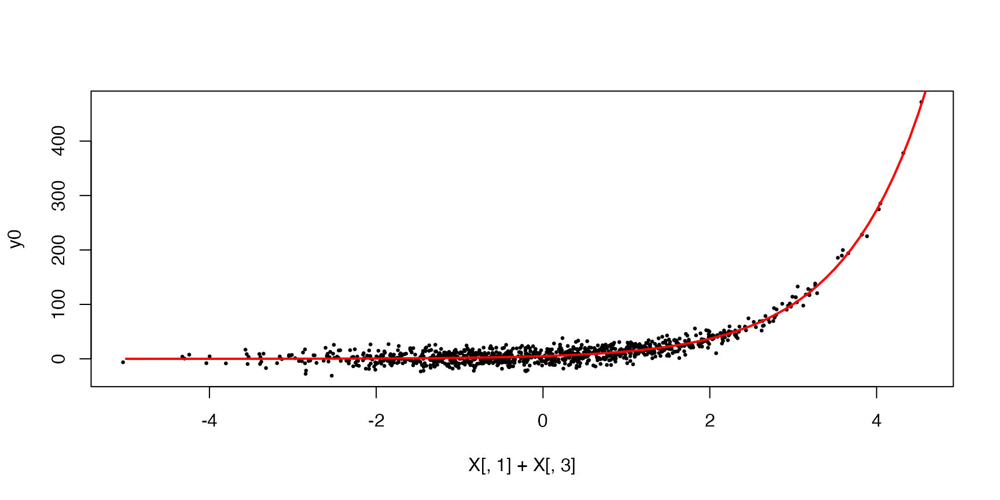
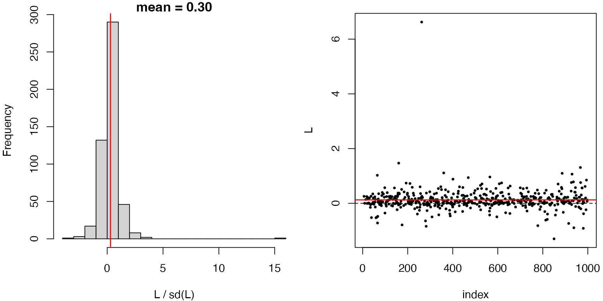
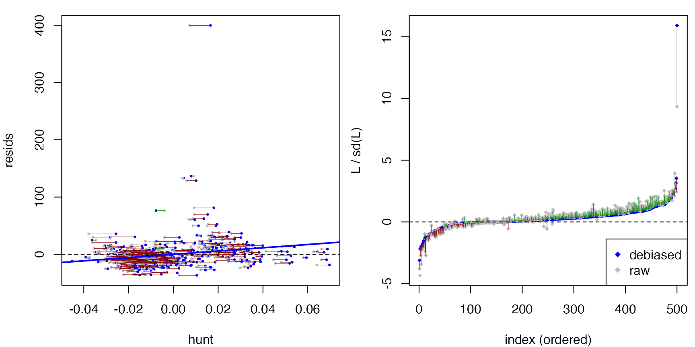

# Link function in GLM

``` r

library(dScoreTest)
```

The package can be used to check and compare (generalized) linear models
with a non-canonical link function. Based on covariates
$`X_1, X_2, X_3`$, suppose the response is generated as
``` math
 Y = 5 \exp(X_1 + X_3) + \varepsilon, \quad \mathbb{E}[\varepsilon \mid X] = 0. 
```
In other words, the regression model is specified as
``` math
 \log \mathbb{E}[Y \mid X] = \alpha + \beta_1 X_1 + \beta_2 X_2 + \beta_3 X_3.
```
To fit this generalized linear model, we must use the *non-canonical
link* `family = gaussian(link = "log")`. Here is a simple simulation.

``` r

set.seed(42)
n <- 1000
X <- matrix(rnorm(n * 3), nrow = n)
X[,2] <- X[,2] + 0.2 * X[,1] - 0.3 * X[,3] 
X[,3] <- X[,3] + 0.1 * X[,1]
f <- 5 * exp(X[,1] + X[,3]) 
y0 <- f + 10 * rnorm(n)
plot(X[,1] + X[,3], y0, pch=20, cex=0.5)
curve(5 * exp(x), -5, 5, add=TRUE, lwd=2, col="red")
```



For testing the model specification, we use:

``` r

# use a start value to help fitting
dat <- data.frame(y0=y0, X1=X[,1], X2=X[,2], X3=X[,3])
fit.0 <- glm(y0 ~ ., family = gaussian(link = "log"), data=dat, start=rep(1,4))
fit.0
#> 
#> Call:  glm(formula = y0 ~ ., family = gaussian(link = "log"), data = dat, 
#>     start = rep(1, 4))
#> 
#> Coefficients:
#> (Intercept)           X1           X2           X3  
#>    1.587816     1.007276     0.003866     1.007188  
#> 
#> Degrees of Freedom: 999 Total (i.e. Null);  996 Residual
#> Null Deviance:       1183000 
#> Residual Deviance: 97820     AIC: 7431
test.0 <- gof_test(fit.0)
test.0
#> Debiased score test: 
#> y ~ X, with X consists of (Intercept), X1, X2, X3.
#> (hunt.style = optimal, hunt.method = grf)
#> n = 1000, two-way split: hunt = 500, debias & test = 500
#> 
#> T = -1.8171, p-value = 0.965397
```

Incorrect specification of the link can be detected by the
goodness-of-fit test.

``` r

# identity link
fit.1 <- glm(y0 ~ ., family = gaussian(), data=dat, start=rep(1,4))
test.1 <- gof_test(fit.1)
test.1
#> Debiased score test: 
#> y ~ X, with X consists of (Intercept), X1, X2, X3.
#> (hunt.style = optimal, hunt.method = grf)
#> n = 1000, two-way split: hunt = 500, debias & test = 500
#> 
#> T = 6.6790, p-value = 1.20309e-11
plot(test.1)
```



We can further use `compare_models` to assess the significance of
predictors:

``` r

# significance of X2
fit.drop2 <- glm(y0 ~ X1 + X3, family = gaussian(link = "log"), 
                  data=dat, start=rep(1,3))
compare_models(fit.drop2, fit.0)
#> Debiased score test: 
#> y ~ X, with X consists of (Intercept), X1, X2, X3.
#> (hunt.style = optimal, hunt.method = glm)
#> n = 1000, two-way split: hunt = 500, debias & test = 500
#> 
#> T = -0.3890, p-value = 0.651351
# compare with anova
anova(fit.0, fit.drop2)
#> Analysis of Deviance Table
#> 
#> Model 1: y0 ~ X1 + X2 + X3
#> Model 2: y0 ~ X1 + X3
#>   Resid. Df Resid. Dev Df Deviance      F Pr(>F)
#> 1       996      97818                          
#> 2       997      97829 -1  -11.764 0.1198 0.7293

# significance of (X2, X3) together
fit.drop23 <- glm(y0 ~ X1, family = gaussian(link = "log"), 
                  data=dat, start=rep(1,2))
compare_models(fit.drop23, fit.0)
#> Debiased score test: 
#> y ~ X, with X consists of (Intercept), X1, X2, X3.
#> (hunt.style = optimal, hunt.method = glm)
#> n = 1000, two-way split: hunt = 500, debias & test = 500
#> 
#> T = 3.3959, p-value = 0.000341982
# compare with anova
anova(fit.0, fit.drop23)
#> Analysis of Deviance Table
#> 
#> Model 1: y0 ~ X1 + X2 + X3
#> Model 2: y0 ~ X1
#>   Resid. Df Resid. Dev Df Deviance      F    Pr(>F)    
#> 1       996      97818                                 
#> 2       998     876971 -2  -779153 3966.7 < 2.2e-16 ***
#> ---
#> Signif. codes:  0 '***' 0.001 '**' 0.01 '*' 0.05 '.' 0.1 ' ' 1
```
