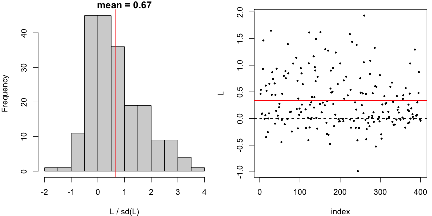
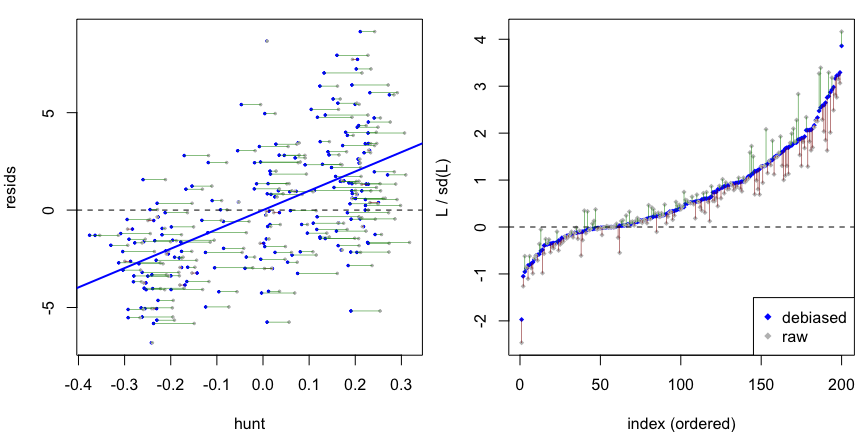

# dScoreTest

Debiased (Neyman-orthogonalized) score tests for assessing whether a
parametric or semiparametric regression model is well-specified and for
comparing nested models.

The test uses sample splitting: on a held-out *hunt* sample, a flexible
auxiliary fit finds a direction in which the null model’s score is
non-zero; on an independent *test* sample, the standardized score along
that direction is evaluated. The orthogonalization absorbs plug-in bias
from estimating the direction, yielding a test statistic that is
asymptotically standard normal under the null without requiring a
parametric form for the alternative. Methods are provided for `glm`,
`lm`, and [`mgcv::gam`](https://rdrr.io/pkg/mgcv/man/gam.html) fits.

## Installation

Install the development version from
[GitHub](https://github.com/richardkwo/dScoreTest) with:

``` r

# install.packages("remotes")
remotes::install_github("richardkwo/dScoreTest")
```

## Usage

Two entry points, both S3 generics that dispatch on the fitted model:

- [`gof_test()`](https://unbiased.co.in/dScoreTest/reference/gof_test.md)
  — is a fitted model well-specified, against a nonparametric
  alternative?
- [`compare_models()`](https://unbiased.co.in/dScoreTest/reference/compare_models.md)
  — does a nested alternative capture signal that the null model misses?

``` r

library(dScoreTest)
library(mgcv)

set.seed(42)
dat <- gamSim(eg = 1, n = 400, dist = "normal", scale = 2, verbose = FALSE)
```

We simulate from the four-term additive truth in `mgcv::gamSim(eg = 1)`,
`y = f0(x0) + f1(x1) + f2(x2) + f3(x3) + noise`, where `f3 = 0` and
`f0, f1, f2` are non-linear.

### Goodness of fit

[`gof_test()`](https://unbiased.co.in/dScoreTest/reference/gof_test.md)
checks the functional form of a fitted model against a nonparametric
alternative. A well-specified non-linear additive model is not rejected,
while forcing the model to be linear is.

``` r

fit.gam <- gam(y ~ s(x0) + s(x1) + s(x2) + s(x3), data = dat)
gof_test(fit.gam)   # well-specified: not rejected
#> Debiased score test: 
#> y ~ X, with X consists of x0, x1, x2, x3.
#> (hunt.style = optimal, hunt.method = grf)
#> n = 400, two-way split: hunt = 200, debias & test = 200
#> 
#> T = 0.6274, p-value = 0.265214

fit.lm <- lm(y ~ x0 + x1 + x2 + x3, data = dat)
gof_test(fit.lm)   # misspecified: 
#> Debiased score test: 
#> y ~ X, with X consists of (Intercept), x0, x1, x2, x3.
#> (hunt.style = optimal, hunt.method = grf)
#> n = 400, two-way split: hunt = 200, debias & test = 200
#> 
#> T = 9.7238, p-value = 1.19302e-22
```

Note that `gof_test` only sees the covariates in the model’s formula, so
it tests whether `E[y | covariates]` has the assumed form, not whether
covariates are missing.

### Model comparison

[`compare_models()`](https://unbiased.co.in/dScoreTest/reference/compare_models.md)
tests a null model against a nested alternative, and detects signal
living in the alternative’s extra terms. Here the null drops `s(x2)` (a
real, sharp effect), while the alternative includes it.

``` r

# null model: well-specified since f3 = 0 in DGM
fit.gam.null <- gam(y ~ s(x0) + s(x1) + s(x2), data = dat)
compare_models(fit.gam.null, fit.gam)
#> Debiased score test: 
#> y ~ X, with X consists of x0, x1, x2, x3.
#> (hunt.style = optimal, hunt.method = gam)
#> n = 400, two-way split: hunt = 200, debias & test = 200
#> 
#> T = 0.9375, p-value = 0.174243

# null model: misspecified, missing f2
fit.gam.mis <- gam(y ~ s(x0) + s(x1), data = dat)  
res <- compare_models(fit.gam.mis, fit.gam)
res
#> Debiased score test: 
#> y ~ X, with X consists of x0, x1, x2, x3.
#> (hunt.style = optimal, hunt.method = gam)
#> n = 400, two-way split: hunt = 200, debias & test = 200
#> 
#> T = 9.5337, p-value = 7.58703e-22
```

Both functions return a `dScoreTest` object with
[`print()`](https://rdrr.io/r/base/print.html),
[`summary()`](https://rdrr.io/r/base/summary.html), and
[`plot()`](https://rdrr.io/r/graphics/plot.default.html) methods. The
hunt for a direction of misspecification can use the optimal
(`hunt.style = "optimal"`, default), weighted-least-squares (`"wls"`),
or vanilla (`"vanilla"`) algorithm.

``` r

plot(res)
```


